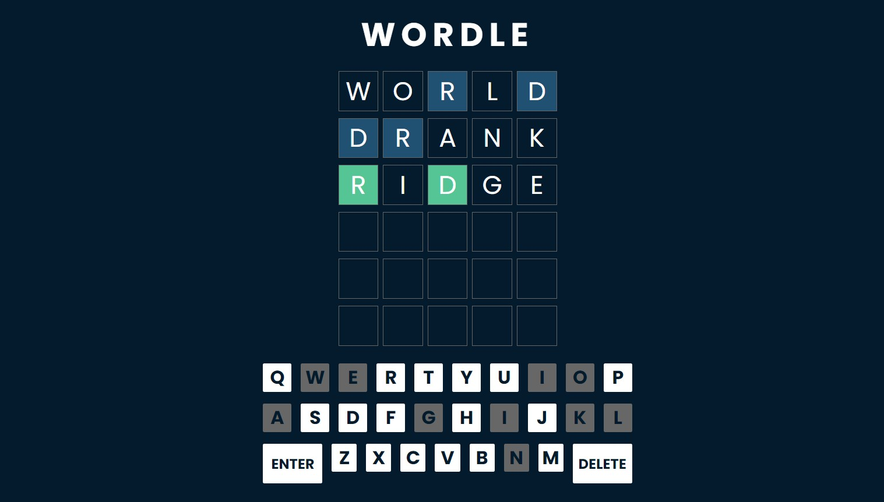

# WORDLE

     

## Live Demo

Try it out here:

## Overview

Wordle is a popular word guessing game originally created by Software Engineer, Josh Wardle. The game tasks the player with correctly selecting a random five-letter word. The player gets six tries to guess the word, and the game will provide hints along the way.

## How To Play

- The game will randomly generate a word for you to guess.
- Type in your guess for the word and press the "Enter" button.
- You will receive the following hints on your guess:
  1. Correct letters in their correct positions appear green.
  2. Correct letters in the wrong position appear blue.
  3. Incorrect letters appear grayed out on the onscreen keyboard.
- Continue guessing until you correctly guess the word or you've exceeded 6 tries.

## Features

- Feedback on guesses, including colour coding for correct letters, almost letters and incorrect letters
- Display of previously guessed letters
- Unlimited play with 2000+ words available
- Rules modal displayed at the start of a game
- Game over modal at the end of a game displaying the word's definition
- Responsive

## Technologies Used

This project was built using the following technologies:

- React
- Javascript
- Sass/CSS
- HTML

## Game Mechanics

- The board is comprised of a matrix of 6 arrays, each containing 5 elements.
- Each board array represents a row on the board, and each element represents a letter position within the row.
- A random word from the word bank is generated at the start of each game.
- The word bank is supplied by a text file and assigned to a Set, as each value is unique and this provides a faster run time than using an array.
- Detects onscreen keyboard clicks as well as physical keyboard clicks. Can only use letters, enter, delete, and backspace on physical keyboard.
- Incorrect letters that have been guessed will be grayed out on the on-screen keyboard.
- Conditional CSS classes control the color hints and take effect once a word try is completed.
- Free Dictionary API is used to provide the word definition(s) at the end of the game.

## Screenshots

### Game Start Rules Modal

### Game Over Win Modal

### Game Over Lose Modal

## Future Scope

- Add the letters animation
- Add a scoreboard for the players
- Add an option to choose the difficulty level
- Add light/dark mode

## How To Run The Project

Clone the project from the Github repo, open in your preferred code editor and run the following commands:

- npm install
- npm start

## Creator

Sarah Salvatore, Full Stack Developer
sarah.h.salvatore@gmail.com
